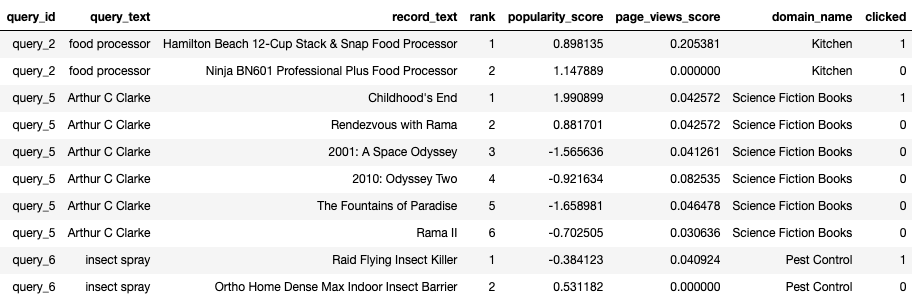
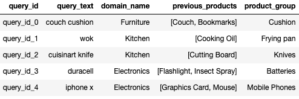

## Using ml4ir as a toolkit

* [Pipelines](#pipelines)
  * [Learning to Rank](#learning-to-rank)
  * [Query Classification](#query-classification)
  * [Custom Pipeline](#custom-pipeline)
* [Command Line Arguments](#command-line-arguments)
* [Usage Examples](#usage-examples)
  * [Learning to Rank](#learning-to-rank-usage)
  * [Query Classification](#query-classification-usage)
  
### Pipelines
ml4ir comes packaged with pre-defined configurable pipelines for popular search ML tasks. Currently, ml4ir supports the following tasks.

#### Learning to Rank
[Learning to Rank(LTR)](https://en.wikipedia.org/wiki/Learning_to_rank) is the task of learning an ranking function that finds the most optimal ordering of a list of documents for a given query to improve relevance. Each document is represented in the dataset as a feature set computed for the query-document pair. The labels for this task can either be graded relevance values defined for the list of records in a query or a binary click/no-click label.



In the sample ranking data above, each row represents a query-document pair of features. Features like `query_text`, `domain_name` are common across documents. Whereas features like `record_text`, `popularity_score`, `quality_score` are unique to each document. In this example, we learn a ranking function using binary clicks as the label. The state of the art LTR models of today rely on listwise losses and complex groupwise scoring functions. 

To train and evaluate a learning to rank model, use the predefined `RankingPipeline`.

#### Query Classification
[Query Classification](https://en.wikipedia.org/wiki/Web_query_classification) is the task of classifying a given user query into a set of predefined categories. Additional features such as user context, domain of query can be used to personalize the predictions.



In the sample query classification data above, each row represents a user query. We try to predict the `product_group` category using the `query_text`, `domain_name` and `previous_products`. These features define the user's context at the time of querying and also the actual query text made by the user. This type of query classification can be used to further narrow down search results and enhance the user search experience.

To train and evaluate a learning to rank model, use the predefined `ClassificationPipeline`.

#### Custom Pipeline
To define your own custom ml4ir pipeline, you can override the `RelevancePipeline`** to plug in the `RelevanceModel` you want to train and evaluate.

### Command Line Arguments

```eval_rst
+-------------------------------+-----------------+-----------------+--------------------------------------------+
| Name                          | Type            | Default         | Description                                |
+===============================+=================+=================+============================================+
| --data_dir                    | <class 'str'>   | None            | Path to the data directory to be used for  |
|                               |                 |                 | training and inference. Can optionally     |
|                               |                 |                 | include train/ val/ and test/              |
|                               |                 |                 | subdirectories. If subdirectories are not  |
|                               |                 |                 | present, data will be split based on       |
|                               |                 |                 | train_pcent_split                          |
+-------------------------------+-----------------+-----------------+--------------------------------------------+
| --data_format                 | <class 'str'>   | tfrecord        | Format of the data to be used. Should be   |
|                               |                 |                 | one of the Data format keys in             |
|                               |                 |                 | ml4ir/config/keys.py                       |
+-------------------------------+-----------------+-----------------+--------------------------------------------+
| --tfrecord_type               | <class 'str'>   | example         | TFRecord type of the data to be used.      |
|                               |                 |                 | Should be one of the TFRecord type keys in |
|                               |                 |                 | ml4ir/config/keys.py                       |
+-------------------------------+-----------------+-----------------+--------------------------------------------+
| --feature_config              | <class 'str'>   | None            | Path to YAML file or YAML string with      |
|                               |                 |                 | feature metadata for training.             |
+-------------------------------+-----------------+-----------------+--------------------------------------------+
| --model_file                  | <class 'str'>   |                 | Path to a pretrained model to load for     |
|                               |                 |                 | either resuming training or for running    |
|                               |                 |                 | ininference mode.                          |
+-------------------------------+-----------------+-----------------+--------------------------------------------+
| --model_config                | <class 'str'>   | ml4ir/base/conf | Path to the Model config YAML used to      |
|                               |                 | ig/default_mode | build the model architecture.              |
|                               |                 | l_config.yaml   |                                            |
+-------------------------------+-----------------+-----------------+--------------------------------------------+
| --optimizer_key               | <class 'str'>   | adam            | Optimizer to use. Has to be one of the     |
|                               |                 |                 | optimizers in OptimizerKey under           |
|                               |                 |                 | ml4ir/config/keys.py                       |
+-------------------------------+-----------------+-----------------+--------------------------------------------+
| --loss_key                    | <class 'str'>   | None            | Loss to optimize. Has to be one of the     |
|                               |                 |                 | losses in LossKey under                    |
|                               |                 |                 | ml4ir/config/keys.py                       |
+-------------------------------+-----------------+-----------------+--------------------------------------------+
| --metrics_keys                | <class 'str'>   | None            | Metric to compute. Can be a list. Has to   |
|                               |                 |                 | be one of the metrics in MetricKey under   |
|                               |                 |                 | ml4ir/config/keys.py                       |
+-------------------------------+-----------------+-----------------+--------------------------------------------+
| --monitor_metric              | <class 'str'>   | None            | Metric name to use for monitoring training |
|                               |                 |                 | loop in callbacks. Must be one MetricKey   |
|                               |                 |                 | under ml4ir/config/keys.py                 |
+-------------------------------+-----------------+-----------------+--------------------------------------------+
| --monitor_mode                | <class 'str'>   | None            | Metric mode to use for monitoring training |
|                               |                 |                 | loop in callbacks                          |
+-------------------------------+-----------------+-----------------+--------------------------------------------+
| --num_epochs                  | <class 'int'>   | 5               | Max number of training epochs(or full pass |
|                               |                 |                 | over the data)                             |
+-------------------------------+-----------------+-----------------+--------------------------------------------+
| --batch_size                  | <class 'int'>   | 128             | Number of data samples to use per batch.   |
+-------------------------------+-----------------+-----------------+--------------------------------------------+
| --learning_rate               | <class 'float'> | 0.01            | Step size (e.g.: 0.01)                     |
+-------------------------------+-----------------+-----------------+--------------------------------------------+
| --learning_rate_decay         | <class 'float'> | 1.0             | Decay rate for the learning rate.Check for |
|                               |                 |                 | more info -> https://www.tensorflow.org/ap |
|                               |                 |                 | i_docs/python/tf/keras/optimizers/schedule |
|                               |                 |                 | s/ExponentialDecay                         |
+-------------------------------+-----------------+-----------------+--------------------------------------------+
| --learning_rate_decay_steps   | <class 'int'>   | 10000000        | Decay rate for the learning rate.Check for |
|                               |                 |                 | more info -> https://www.tensorflow.org/ap |
|                               |                 |                 | i_docs/python/tf/keras/optimizers/schedule |
|                               |                 |                 | s/ExponentialDecay                         |
+-------------------------------+-----------------+-----------------+--------------------------------------------+
| --compute_intermediate_stats  | <class 'bool'>  | True            | Whether to compute intermediate stats on   |
|                               |                 |                 | test set (mrr, acr, etc) (slow)            |
+-------------------------------+-----------------+-----------------+--------------------------------------------+
| --execution_mode              | <class 'str'>   | train_inference | Execution mode for the pipeline. Should be |
|                               |                 | _evaluate       | one of ExecutionModeKey                    |
+-------------------------------+-----------------+-----------------+--------------------------------------------+
| --random_state                | <class 'int'>   | 123             | Initialize the seed to control randomness  |
|                               |                 |                 | for replication                            |
+-------------------------------+-----------------+-----------------+--------------------------------------------+
| --run_id                      | <class 'str'>   |                 | Unique string identifier for the current   |
|                               |                 |                 | training run. Used to identify logs and    |
|                               |                 |                 | models directories. Autogenerated if not   |
|                               |                 |                 | specified.                                 |
+-------------------------------+-----------------+-----------------+--------------------------------------------+
| --run_group                   | <class 'str'>   | general         | Unique string identifier to group multiple |
|                               |                 |                 | model training runs. Allows for defining a |
|                               |                 |                 | meta grouping to filter different model    |
|                               |                 |                 | training runs for best model selection as  |
|                               |                 |                 | a post step.                               |
+-------------------------------+-----------------+-----------------+--------------------------------------------+
| --run_notes                   | <class 'str'>   |                 | Notes for the current training run. Use    |
|                               |                 |                 | this argument to add short description of  |
|                               |                 |                 | the model training run that helps in       |
|                               |                 |                 | identifying the run later.                 |
+-------------------------------+-----------------+-----------------+--------------------------------------------+
| --models_dir                  | <class 'str'>   | models/         | Path to save the model. Will be expanded   |
|                               |                 |                 | to models_dir/run_id                       |
+-------------------------------+-----------------+-----------------+--------------------------------------------+
| --logs_dir                    | <class 'str'>   | logs/           | Path to save the training/inference logs.  |
|                               |                 |                 | Will be expanded to logs_dir/run_id        |
+-------------------------------+-----------------+-----------------+--------------------------------------------+
| --checkpoint_model            | <class 'bool'>  | True            | Whether to save model checkpoints at the   |
|                               |                 |                 | end of each epoch. Recommended - set to    |
|                               |                 |                 | True                                       |
+-------------------------------+-----------------+-----------------+--------------------------------------------+
| --train_pcent_split           | <class 'float'> | 0.8             | Percentage of all data to be used for      |
|                               |                 |                 | training. The remaining is used for        |
|                               |                 |                 | validation and testing. Remaining data is  |
|                               |                 |                 | split in half if val_pcent_split or        |
|                               |                 |                 | test_pcent_split are not specified.        |
+-------------------------------+-----------------+-----------------+--------------------------------------------+
| --val_pcent_split             | <class 'float'> | -1              | Percentage of all data to be used for      |
|                               |                 |                 | testing.                                   |
+-------------------------------+-----------------+-----------------+--------------------------------------------+
| --test_pcent_split            | <class 'float'> | -1              | Percentage of all data to be used for      |
|                               |                 |                 | testing.                                   |
+-------------------------------+-----------------+-----------------+--------------------------------------------+
| --max_sequence_size           | <class 'int'>   | 0               | Maximum number of elements per sequence    |
|                               |                 |                 | feature.                                   |
+-------------------------------+-----------------+-----------------+--------------------------------------------+
| --inference_signature         | <class 'str'>   | serving_default | SavedModel signature to be used for        |
|                               |                 |                 | inference                                  |
+-------------------------------+-----------------+-----------------+--------------------------------------------+
| --use_part_files              | <class 'bool'>  | False           | Whether to look for part files while       |
|                               |                 |                 | loading data                               |
+-------------------------------+-----------------+-----------------+--------------------------------------------+
| --logging_frequency           | <class 'int'>   | 25              | How often to log results to log file. Int  |
|                               |                 |                 | representing number of batches.            |
+-------------------------------+-----------------+-----------------+--------------------------------------------+
| --group_metrics_min_queries   | <class 'int'>   | None            | Minimum number of queries per group to be  |
|                               |                 |                 | used to computed groupwise metrics.        |
+-------------------------------+-----------------+-----------------+--------------------------------------------+
| --gradient_clip_value         | <class 'float'> | 5.0             | Gradient clipping value/threshold for the  |
|                               |                 |                 | optimizer.                                 |
+-------------------------------+-----------------+-----------------+--------------------------------------------+
| --compile_keras_model         | <class 'bool'>  | False           | Whether to compile a loaded SavedModel     |
|                               |                 |                 | into a Keras model. NOTE: This requires    |
|                               |                 |                 | that the SavedModel's architecture, loss,  |
|                               |                 |                 | metrics, etc are the same as the           |
|                               |                 |                 | RankingModelIf that is not the case, then  |
|                               |                 |                 | you can still use a SavedModel from a      |
|                               |                 |                 | model_file for inference/evaluation only   |
+-------------------------------+-----------------+-----------------+--------------------------------------------+
| --use_all_fields_at_inference | <class 'bool'>  | False           | Whether to require all fields in the       |
|                               |                 |                 | serving signature of the SavedModel. If    |
|                               |                 |                 | set to False, only requires fields with    |
|                               |                 |                 | required_only=True                         |
+-------------------------------+-----------------+-----------------+--------------------------------------------+
| --pad_sequence_at_inference   | <class 'bool'>  | False           | Whether to pad sequence at inference time. |
|                               |                 |                 | Used to define the TFRecord serving        |
|                               |                 |                 | signature in the SavedModel                |
+-------------------------------+-----------------+-----------------+--------------------------------------------+
| --output_name                 | <class 'str'>   | relevance_score | Name of the output node of the model       |
+-------------------------------+-----------------+-----------------+--------------------------------------------+
| --early_stopping_patience     | <class 'int'>   | 2               | How many epochs to wait before early       |
|                               |                 |                 | stopping on metric degradation             |
+-------------------------------+-----------------+-----------------+--------------------------------------------+
| --file_handler                | <class 'str'>   | local           | String specifying the file handler to be   |
|                               |                 |                 | used. Should be one of FileHandler keys in |
|                               |                 |                 | ml4ir/base/config/keys.py                  |
+-------------------------------+-----------------+-----------------+--------------------------------------------+
| --initialize_layers_dict      | <class 'str'>   | {}              | Dictionary of pretrained layers to be      |
|                               |                 |                 | loaded.The key is the name of the layer to |
|                               |                 |                 | be assigned the pretrained weights.The     |
|                               |                 |                 | value is the path to the pretrained        |
|                               |                 |                 | weights.                                   |
+-------------------------------+-----------------+-----------------+--------------------------------------------+
| --freeze_layers_list          | <class 'str'>   | []              | List of layer names that are to be frozen  |
|                               |                 |                 | instead of training.Usually coupled with   |
|                               |                 |                 | initialize_layers_dict to load pretrained  |
|                               |                 |                 | weights and freeze them                    |
+-------------------------------+-----------------+-----------------+--------------------------------------------+
```

### Usage Examples

#### Learning to Rank <a name="learning-to-rank-usage"></a>

Using TFRecord input data
```
python ml4ir/applications/ranking/pipeline.py \
--data_dir ml4ir/applications/ranking/tests/data/tfrecord \
--feature_config ml4ir/applications/ranking/tests/data/config/feature_config.yaml \
--run_id test \
--data_format tfrecord \
--execution_mode train_inference_evaluate
```

Using CSV input data
```
python ml4ir/applications/ranking/pipeline.py \
--data_dir ml4ir/applications/ranking/tests/data/csv \
--feature_config ml4ir/applications/ranking/tests/data/config/feature_config.yaml \
--run_id test \
--data_format csv \
--execution_mode train_inference_evaluate
```

Running in inference mode using the default serving signature
```
python ml4ir/applications/ranking/pipeline.py \
--data_dir ml4ir/applications/ranking/tests/data/tfrecord \
--feature_config ml4ir/applications/ranking/tests/data/config/feature_config.yaml \
--run_id test \
--data_format tfrecord \
--model_file `pwd`/models/test/final/default \
--execution_mode inference_only
```

#### Query Classification <a name="query-classification-usage"></a>

Using TFRecord
```
python ml4ir/applications/classification/pipeline.py \
--data_dir ml4ir/applications/classification/tests/data/tfrecord \
--feature_config ml4ir/applications/classification/tests/data/configs/feature_config.yaml \
--model_config ml4ir/applications/classification/tests/data/configs/model_config.yaml \
--batch_size 32 \
--run_id test \
--data_format tfrecord \
--execution_mode train_inference_evaluate
```

Using CSV
```
python ml4ir/applications/classification/pipeline.py \
--data_dir ml4ir/applications/classification/tests/data/tfrecord \
--feature_config ml4ir/applications/classification/tests/data/configs/feature_config.yaml \
--model_config ml4ir/applications/classification/tests/data/configs/model_config.yaml \
--batch_size 32 \
--run_id test \
--data_format csv \
--execution_mode train_inference_evaluate
```

Running in inference mode using the default serving signature
```
python ml4ir/applications/classification/pipeline.py \
--data_dir ml4ir/applications/classification/tests/data/tfrecord \
--feature_config ml4ir/applications/classification/tests/data/configs/feature_config.yaml \
--model_config ml4ir/applications/classification/tests/data/configs/model_config.yaml \
--batch_size 32 \
--run_id test \
--data_format tfrecord \
--model_file `pwd`/models/test/final/default \
--execution_mode inference_only
```
  
  
